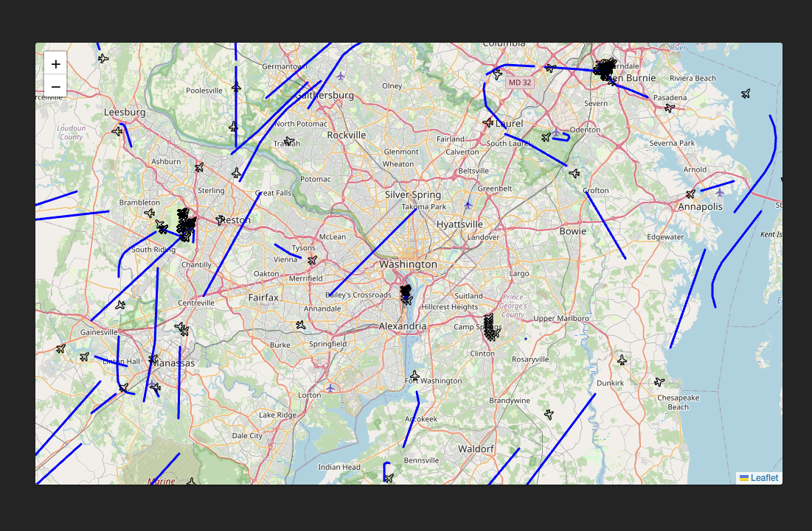

# Flight Map Tracker

React visual display of aircraft in flight in a 50 nautical miile radius of Wachington D. C. This app includes:

* server-sent data captured EventSource API
* Leaflet.js map api
* Flight data from ADSBexchange.com
* A private NPM package I made of a React component library (requires access)

Visual:

## Getting Started

1. Inlude an `.npmrc` file with access to my private npm package.
2. Install: `npm i && npm run dev`